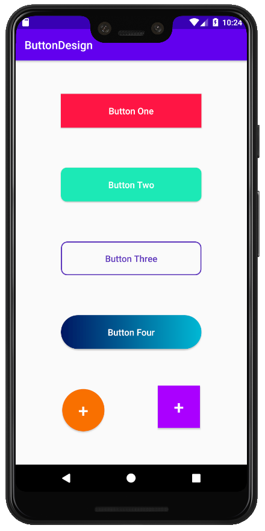

# ButtonDesign
Designing some different kind of buttons.

## General steps:

1. Add a new drawable resource file in drawable folder.
2. Change "selector" to "shape".
3. Shape type = "rectagule".
4. Add solid color (for example, Button One or Two).
5. Add stroke color (for example, Button Three).
6. Add round corners using radius (for example, Button Three or Four).
7. Add gradient property (startColor/endColor/type, Button Four)
8. Add Shape type = "oval" (for example, Button Five/+).
9. Include this resource file using background property in activity_main.xml.

## Final Result:

